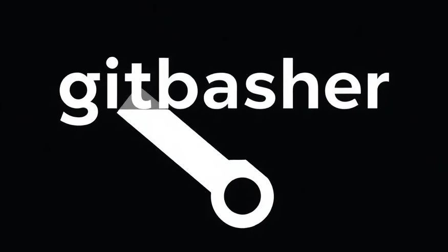

# gitbasher

[](https://github.com/maxbolgarin/gitbasher/releases/latest)
[](https://github.com/maxbolgarin/gitbasher/blob/master/LICENSE)
[](https://github.com/maxbolgarin/gitbasher/actions)


<picture>
  
</picture>

---

> Simple **bash** utility that makes **git** easy to use

With **gitbasher** usage of `git` becomes more simple and intuitive. It helps speeding up the development process, making it more consistent reducing mistakes. This is a wrapper around the most used git commands with a cleaner interface. It uses `bash`, `git`, `sed`, `grep` and some built-in utilities.

<picture>
    
<picture>

### Installation

```
GITB_PATH=/usr/local/bin/gitb && \
curl -SL https://raw.githubusercontent.com/maxbolgarin/gitbasher/main/dist/gitb -o $GITB_PATH && \
chmod +x $GITB_PATH
```

In Windows use `wsl` (enter `wsl` in terminal, [read more](https://learn.microsoft.com/en-us/windows/wsl/setup/environment)) to enable Linux environment. Directory `/usr/local/bin/` is not mandatory. If you get `Permission denied`, use `sudo` or put it to `~/.local/bin` with adding it to `PATH` ([how](https://discussions.apple.com/thread/254226896)).


## Getting Started
- [Why you should try this](#why-you-should-try-this)
- [How to start](#how-to-start)
- [Examples](#examples)
- [Documentation](#documentation)
- [Troubleshooting](#troubleshooting)
- [Contributing](#contributing)


## Why you should try this

**gitbasher** is essential if you use `git` on the daily basis. Benefits you will get:

* Development process will be faster because you will spend almost no time on git
* No need to remember/google the exact names of commands and their parameters
* Making "advanced" commands like `git rebase` more user-friendly, so you will be able to unleash the full potential of the git system without any particular difficulties
* Following the [GitHub flow](https://docs.github.com/en/get-started/quickstart/github-flow) in the development process by simplifying the work with branches
* Making the development process clearer by using conventional commits; **gitbasher** uses [Conventional style of commits](https://www.conventionalcommits.org/en) ([example](https://gist.github.com/brianclements/841ea7bffdb01346392c))


<picture>
    
<picture>


## How to start

Just [install](Installation) gitbasher and use it in any git repository - just run `gitb` in the terminal. It requires bash version 4 or higher and set remote in the repository.

Usage `gitb <command> <mode>`

* `gitb c` for commit creation
* `gitb b n` for branch creation
* `gitb pu` for pulling from the remote
* `gitb p` for pushing to the remote

Use `gitb c help` to get help about commit commands. You can get help with `help` for all other commands. To get a global help enter `gitb`. You can find all commands description in the [documentation](#documentation).


## Examples

#### Commit: [`gitb c`](#gitb-commit-mode)

* Select files to commit and create a message in the format: `type(scope): message`
* There are a lot of modes for commit creation, e.g. `--amend`, `--fixup`, `revert`, `push` after commit
* For example, a single `gitb c p` replaces 4 commands: 

```bash
    git status
    git add ...
    git commit -m "..."
    git push
```


#### Push: [`gitb p`](#gitb-push-mode)

* Print a list of unpushed commits, push them to the current remote branch or pull changes first
* Avoid calling `git push ... -> git pull ... -> git push ...` if there are unpulled changes in branch, `gitb push` handles such changes in a single call


#### Pull: [`gitb pu`](#gitb-pull-mode)

* Fetch current branch and then ff/merge/rebase changes with conflicts fixing
* You can choose `merge` or `rebase` mode if fast-forward is not possible
* For example, you can avoid starting a merge due to an accidental call of `git pull origin master` while being in another branch


#### Branch: [`gitb b`](#gitb-branch-mode)
* With `gitb b` you can select a branch to switch from a list, it may be helpful if you don't remember the name of the branch
* With `gitb b nd` you can create a new branch from the default one with latest changes. It replaces these commands:
```
    git switch main
    git pull origin main
    git switch -c ...
```


#### Tags: [`gitb t`](#gitb-tag-mode)
* With `gitb t` you can create a new tag from a current commit and push it to a remote
* Full tag managment: creation, fetching, pushing, deleting


#### Merge: [`gitb m`](#gitb-merge-mode)
* Select branch to merge into the current one and fix conflicts
* Create a merge commit after merging


#### Rebase: [`gitb r`](#gitb-rebase-mode)
* Rebase branch with pretty conflict fixing without infinite writing of `git rebase --continue`
* Select a commit to rebase with autosquash, it is very helpful to make a commit history better


#### Reset: [`gitb res`](#gitb-reset-mode)
* Undo commits and actions in the fast way


## Troubleshooting

Most likely, if you have Linux, the necessary software is already installed on your machine. On MacOS, there is an outdated `bash` and there may be no `git` by default, so you should use `homebrew` to install it. On Windows you should use `wsl`, it will create a Linux environment for you with all necessary software.


#### Requirements

* `bash` version from 4.0
	* Debian-based: `apt install --only-upgrade bash`
	* MacOS: `brew install bash`
* `git` version from 2.23
	* Debian-based: `git --version || apt install git`
	* MacOS: `git --version || brew install git`


#### Uninstall

```
sudo rm /usr/local/bin/gitb
```


## Contributing

If you'd like to contribute to **gitbasher**, make a fork and submit a pull request. You also can open an issue or text me on Telegram: https://t.me/maxbolgarin

#### Scopes

Here are the possible values for `<scope>` in a commit message header. Use only these values when making commits in this repository (use no scope for global changes):

| **Scope**    | **Description**                                                                 |
|--------------|---------------------------------------------------------------------------------|
| **commit**   | Changes mainly in `commit.sh` script, related to commit features and fixes      |
| **push**     | Changes mainly in `push.sh` script, related to push features and fixes          |
| **pull**     | Changes mainly in `pull.sh` script, related to pull features and fixes          |
| **merge**    | Changes mainly in `merge.sh` script, related to merge features and fixes        |
| **rebase**   | Changes mainly in `rebase.sh` script, related to rebase features and fixes      |
| **branch**   | Changes mainly in `branch.sh` script, related to branching features and fixes   |
| **tag**      | Changes mainly in `tag.sh` script, related to tag features and fixes            |  
| **reset**    | Changes mainly in `reset.sh` script, related to reset features and fixes        |  
| **config**   | Changes mainly in `config.sh` script, related to config features and fixes      |


#### Maintainers

* [maxbolgarin](https://github.com/maxbolgarin)

#### License

The source code license is MIT, as described in the [LICENSE](./LICENSE) file.
